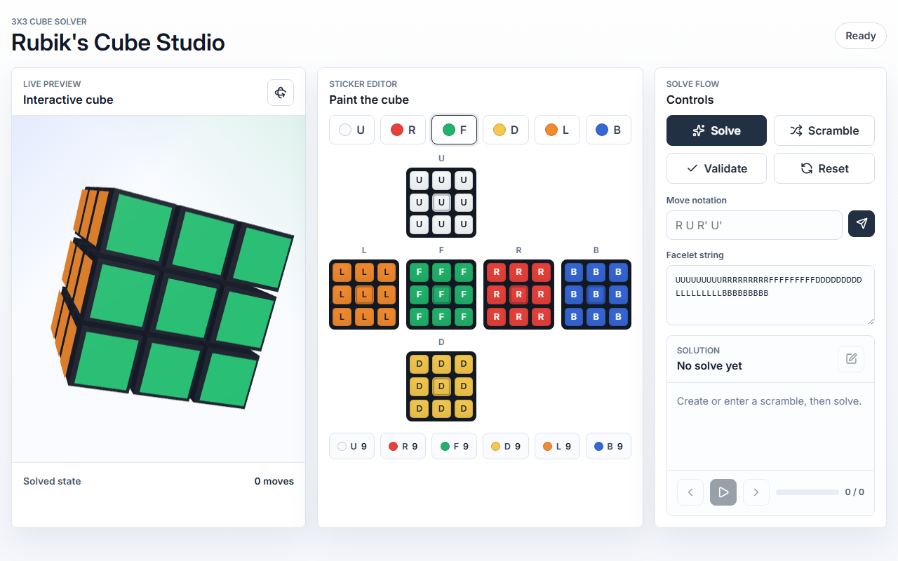
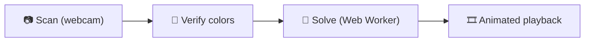
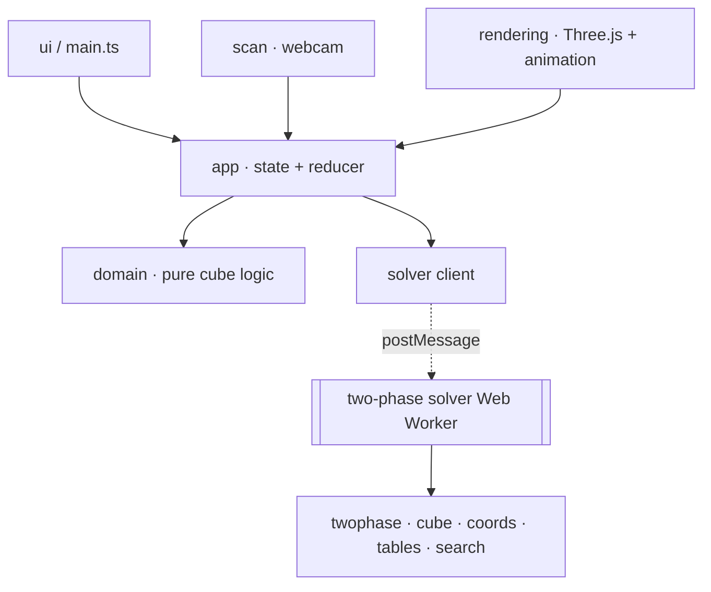

# Rubik's Cube Studio

[](https://github.com/rahulpaul-07/rubiks-cube-studio/actions/workflows/ci.yml)
[](LICENSE)
[](https://rubiks-cube-studio.vercel.app)
[](https://vercel.com/new/clone?repository-url=https%3A%2F%2Fgithub.com%2Frahulpaul-07%2Frubiks-cube-studio)

An interactive 3×3 Rubik's Cube studio: **scan a real cube with your webcam**, verify the colors,
and watch a **hand-written Kociemba two-phase solver** — running in a Web Worker — drive an
**animated 3D solution**. Built with TypeScript and Three.js — the solution itself is computed entirely by a
hand-written solver, with no third-party solver involved.

**[Try the live demo →](https://rubiks-cube-studio.vercel.app)**



Users can paint or import a cube state, validate sticker counts and centers, generate a scramble,
apply move notation, solve the cube, and inspect the solution through step-by-step playback.

## Highlights

- 🧠 **Custom two-phase solver, from scratch** — cubie model, coordinate reduction, move and pruning
  tables, and IDA\* search. No third-party solver computes the solution. Averages **~20.6 moves** (God's number
  is 20) and is **100% correct** across 1,500+ random cubes, verified against an independent engine.
- 📷 **Webcam cube scanning** — capture all six faces and classify stickers with an HSV color
  pipeline.
- 🎞️ **Animated 3D playback** — every solution move is a real layer rotation, run off the main
  thread so rendering never stutters.
- 🧪 **Engineered like production** — 66 unit tests, Playwright end-to-end tests, strict TypeScript,
  a zero-warning ESLint pass, coverage thresholds, and CI on every push.

## Data flow



## Features

- Interactive 54-sticker cube editor with fixed centers
- Webcam cube scanning with automatic sticker-color detection
- Guided Scan → Verify → Solve → Play wizard flow
- Animated per-face-turn solution playback
- Synchronized Three.js cube preview with pointer rotation
- Facelet-string import and export
- Standard move-notation input
- Random scramble generation
- Custom Kociemba two-phase solver running in a Web Worker (no runtime solver dependency)
- Solution timing, move count, copying, and playback controls
- Responsive desktop and mobile layouts
- Installable PWA with offline support via a service worker (works with no network after first load)
- Accessibility: keyboard-operable controls, focus-trapped scan modal, and `prefers-reduced-motion`
  support
- SEO meta tags, Open Graph/Twitter cards, and a Web App Manifest
- Render loop pauses automatically on backgrounded tabs to save battery and CPU

## Custom two-phase solver

The cube is solved by a **from-scratch implementation of Kociemba's two-phase algorithm** — there is
no third-party solver computes the solution. It runs entirely inside a **Web Worker**, so building lookup
tables and searching never block rendering or the turn animation.

**How it works.** The solver models the cube at the cubie level (corner and edge permutation and
orientation) and reduces solving to a search over compact integer _coordinates_:

- **Phase 1** drives the cube into the ⟨U, D, R2, L2, F2, B2⟩ subgroup (G1) using
  corner-orientation, edge-orientation, and UD-slice-location coordinates.
- **Phase 2** finishes within G1 using corner-permutation, edge-permutation, and slice-permutation
  coordinates.

Each coordinate has a precomputed **move table**, and admissible **pruning tables** (built by
breadth-first search outward from the goal) provide a lower bound on the remaining depth. An
**IDA\*** search uses those bounds to find a short solution, then keeps refining toward the optimum
within a time budget. Physically impossible cubes (wrong permutation parity, a single flipped edge,
and so on) are rejected up front.

**Measured performance** (`npm run benchmark`):

| Metric                            | Result                                                           |
| --------------------------------- | ---------------------------------------------------------------- |
| Correctness                       | 100% over 1,500+ random cubes, verified by an independent engine |
| Average solution                  | ~20.6 moves (God's number is 20)                                 |
| Longest solution                  | ≤ 23 moves; every solve within 26 HTM                            |
| Table build (one-time, in worker) | ~0.7 s                                                           |
| Solve budget                      | 100 ms per cube                                                  |

Every one of the solver's 18 face moves and every coordinate transition is unit-tested against a
reference engine (`cubejs`), and full solutions are re-verified
move-for-move by that independent engine on thousands of random cubes (`src/solver/twophase/`).

## Technology

- **TypeScript** for strict application and domain types
- **Vite** for local development and production builds
- **Three.js** for the interactive WebGL preview
- **A hand-written Kociemba two-phase solver** in a Web Worker (`src/solver/twophase/`)
- **cubejs** for cube-state legality validation, and as an independent solver oracle in tests
- **ESLint and Prettier** for automated code-quality checks
- **Vitest** and **Playwright** for unit and end-to-end testing
- **GitHub Actions** for continuous integration

## Architecture

The codebase separates cube rules from browser-specific behavior:

```text
src/
├── app/        Application state and actions
├── domain/     Cube rules, parsing, notation, scrambles, validation, color detection
├── scan/       Webcam capture and sticker sampling
├── rendering/  Three.js preview, animated face turns, sticker placement
├── solver/     Web Worker client + from-scratch two-phase solver (twophase/)
├── styles/     Base, component, and design-token styles
├── ui/         DOM access and application template
└── main.ts     Application orchestration and event handling
```



Dependencies flow from the UI and rendering layers toward the application and domain layers. The
domain modules do not depend on the DOM, Three.js, or the solver implementation. See
[ARCHITECTURE.md](ARCHITECTURE.md) for the full dependency-flow diagram and design rationale.

## Testing & quality

Every change runs through the same checks locally and in CI:

- **66 unit tests** across 11 files (Vitest), covering domain logic, the state reducer, the
  animation math, color detection, and the two-phase solver — the solver's output is re-verified
  move-for-move by an independent engine. **Coverage thresholds** are enforced in CI.
- **End-to-end tests** (Playwright) exercising the real browser flow: load, scramble, apply moves,
  and solve.
- **Strict TypeScript** (`tsc --noEmit`) and a zero-warning **ESLint** pass on every commit.
- **Prettier** formatting enforced via `format:check` and a Husky pre-commit hook.
- **GitHub Actions** runs the full `check` pipeline plus a dedicated end-to-end job on every push
  and pull request, each bounded by an explicit `timeout-minutes` so a hung test fails fast instead
  of silently consuming CI time.

Run everything locally with:

```bash
npm run check
```

## Prerequisites

- Node.js `20.19.0` or newer supported release (`22.12.0+` for Node 22)
- npm `10.8.2` or newer

The repository pins Node.js `24.14.0` in `.nvmrc` and npm `11.9.0` in `package.json`. With a
compatible Node Version Manager installed, run `nvm use` from the repository root.

## Local development

```bash
git clone https://github.com/rahulpaul-07/rubiks-cube-studio.git
cd rubiks-cube-studio
nvm use
npm ci
npm run dev
```

Vite serves the application at `http://127.0.0.1:5173` by default.

## Commands

| Command                 | Purpose                                                         |
| ----------------------- | --------------------------------------------------------------- |
| `npm run dev`           | Start the local development server                              |
| `npm run build`         | Type-check and create the production bundle                     |
| `npm run preview`       | Preview the production bundle locally                           |
| `npm run test`          | Run unit tests once                                             |
| `npm run test:watch`    | Run unit tests in watch mode                                    |
| `npm run test:coverage` | Run unit tests with coverage report                             |
| `npm run test:e2e`      | Run Playwright end-to-end tests                                 |
| `npm run test:e2e:ui`   | Run Playwright tests in interactive UI mode                     |
| `npm run format`        | Format supported project files                                  |
| `npm run format:check`  | Verify formatting without modifying files                       |
| `npm run lint`          | Run ESLint                                                      |
| `npm run typecheck`     | Run TypeScript without emitting files                           |
| `npm run benchmark`     | Benchmark the two-phase solver (move count, timing, throughput) |
| `npm run check`         | Run formatting, linting, type checking, tests, and build checks |

## Cube representation

Cube states use the 54-character facelet format expected by `cubejs`, ordered as:

```text
UUUUUUUUURRRRRRRRRFFFFFFFFFDDDDDDDDDLLLLLLLLLBBBBBBBBB
```

The six face identifiers are `U`, `R`, `F`, `D`, `L`, and `B`. Each face must contain nine stickers,
and its center sticker is fixed.

Moves use standard notation such as `R U R' U'`. A suffix of `'` means counterclockwise and `2`
means a half turn.

## Current validation scope

The application currently validates:

- Total facelet count
- Supported face identifiers
- Nine stickers per color
- Fixed center positions
- Physical cubie-level uniqueness, parity, and orientation (via the `cubejs` solver engine)

## Deployment

`render.yaml` configures a Render Static Site:

- Build command: `npm ci && npm run build`
- Publish directory: `dist`
- SPA fallback: all routes rewrite to `/index.html`

The live demo linked above is deployed on Vercel via the same production build.

## Documentation

- [ARCHITECTURE.md](ARCHITECTURE.md) — module map, dependency flow, and design decisions
- [CONTRIBUTING.md](CONTRIBUTING.md) — development setup, workflow, and code style
- [CHANGELOG.md](CHANGELOG.md) — notable changes by release

## Known limitations

- Solver lookup tables are rebuilt on each Web Worker start (~0.7 s) rather than being cached across
  sessions; persisting them (e.g. in IndexedDB) would make warm starts instant.

## License

[MIT](LICENSE)
